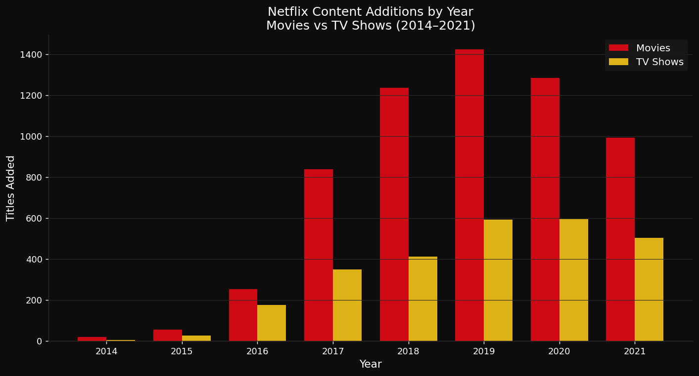
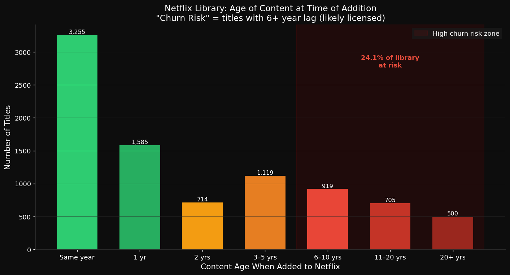
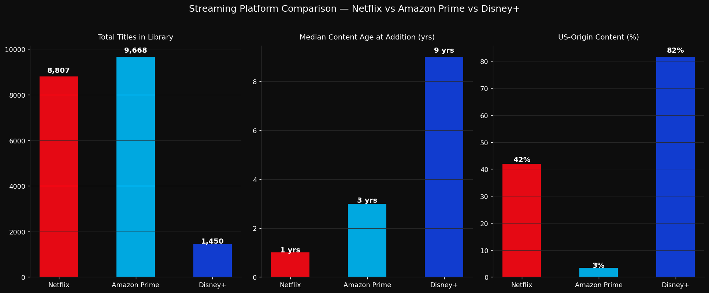
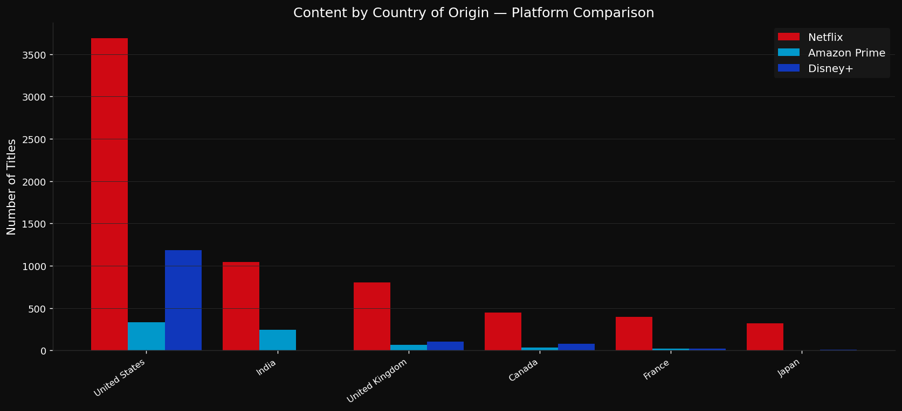
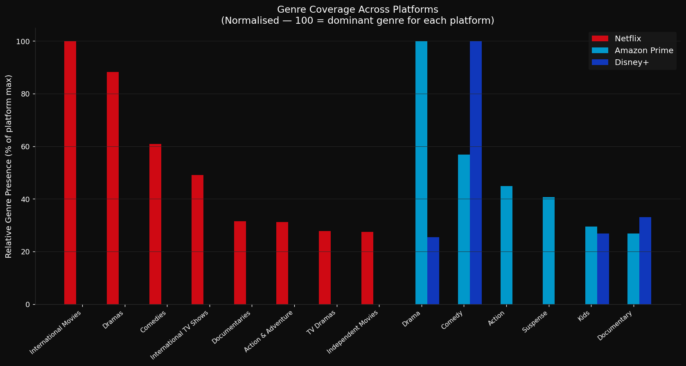
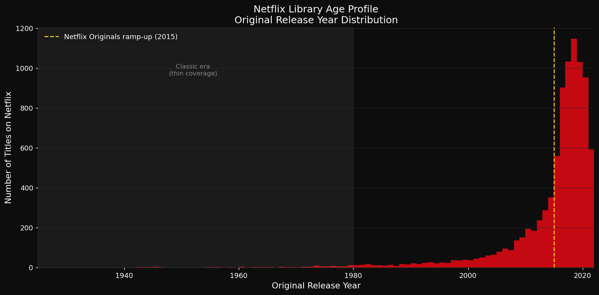

# 📉 What Disappears: A Streaming Content Churn & Gap Analysis

[](https://www.python.org/)
[](https://opensource.org/licenses/MIT)
[](https://jupyter.org/)
[](https://www.kaggle.com/)

---

## Overview

Most streaming analytics ask *what's popular*. This project asks *what's at risk of disappearing* — and what was never there to begin with.

Using catalogue data from Netflix, Amazon Prime Video, and Disney+, this analysis identifies the segment of Netflix's library most vulnerable to content churn, benchmarks platform strategies against each other, and maps genre and geographic gaps in the streaming landscape.

The output is a **market analyst brief** rather than a conventional data science notebook — written for a strategic audience, not a technical one.

> **Key findings:** 24% of Netflix's library (≈2,100 titles) consists of licensed content added 6+ years after original release — the highest churn-risk segment. Netflix's content additions peaked in 2019 and have since moderated, coinciding with a pivot toward owned originals. Disney+ and Netflix are not competing for the same audience.

---

## The Brief

📄 **[Read the full analyst brief →](docs/analyst_brief.md)**

---

## Figures

| Figure | Description |
|--------|-------------|
|  | **Content Velocity** — Titles added per year, Movies vs TV Shows |
|  | **Churn Risk Segment** — Library breakdown by content age at acquisition |
|  | **Platform Comparison** — Library size, content lag, US-origin % |
|  | **Country of Origin** — Geographic diversity across platforms |
|  | **Genre Coverage** — Normalised genre presence by platform |
|  | **Library Age Profile** — Release year distribution of Netflix catalogue |

---

## Data Sources

| Dataset | Source | Size |
|---------|--------|------|
| Netflix Movies and TV Shows | [Kaggle — shivamb](https://www.kaggle.com/datasets/shivamb/netflix-shows) | 8,807 titles |
| Amazon Prime Video Titles | [Kaggle](https://www.kaggle.com/datasets/shivamb/amazon-prime-movies-and-tv-shows) | 9,668 titles |
| Disney+ Movies and TV Shows | [Kaggle](https://www.kaggle.com/datasets/shivamb/disney-movies-and-tv-shows) | 1,450 titles |

> Raw data files are not committed to this repository. Download from the links above and place in `data/raw/`.

---

## Project Structure

```
Netflix Content Analysis/
│
├── data/
│   └── raw/                        # Downloaded CSVs (not tracked)
│       ├── netflix_titles.csv
│       ├── amazon_prime_titles.csv
│       └── disney_plus_titles.csv
│
├── docs/
│   └── analyst_brief.md            # Main deliverable — market analyst brief
│
├── notebooks/
│   └── 01_analysis.ipynb           # Full analysis notebook
│
├── outputs/
│   ├── figures/                    # All chart exports
│   └── tables/                     # Summary CSVs
│
├── .gitignore
├── LICENSE
├── README.md
└── requirements.txt
```

---

## Setup

```bash
git clone https://github.com/ao-chaos/Data_portfolio.git
cd Data_portfolio/Netflix-Content-Analysis

python -m venv venv
source venv/bin/activate       # Windows: venv\Scripts\activate
pip install -r requirements.txt
```

Download the three Kaggle datasets and place them in `data/raw/`, then open `notebooks/01_analysis.ipynb`.

---

## License

MIT License — see [LICENSE](LICENSE).

---

*Analysis by Zari Syed · June 2025*
