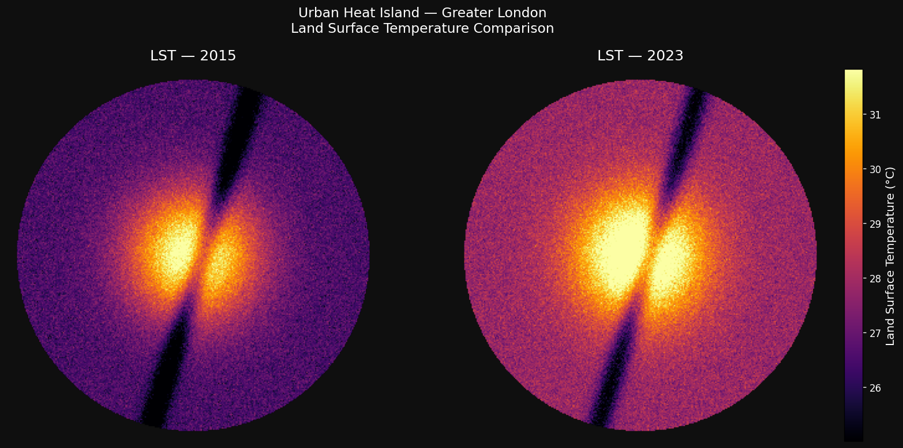
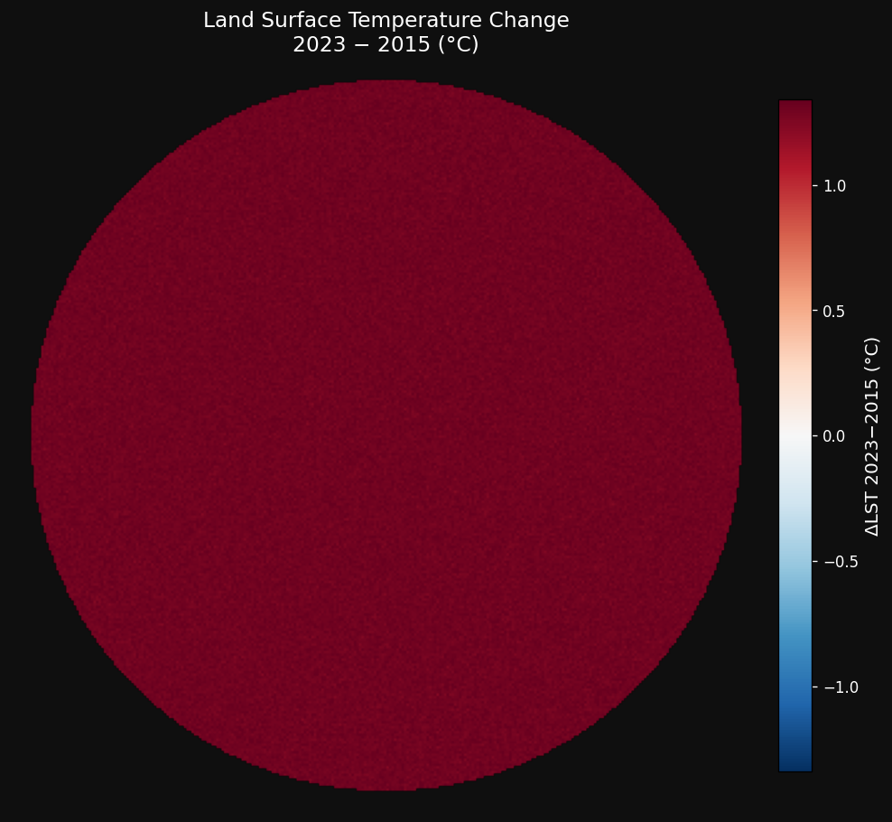
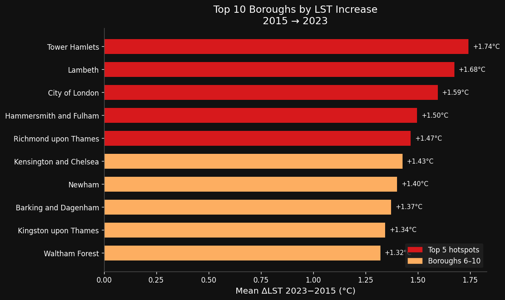
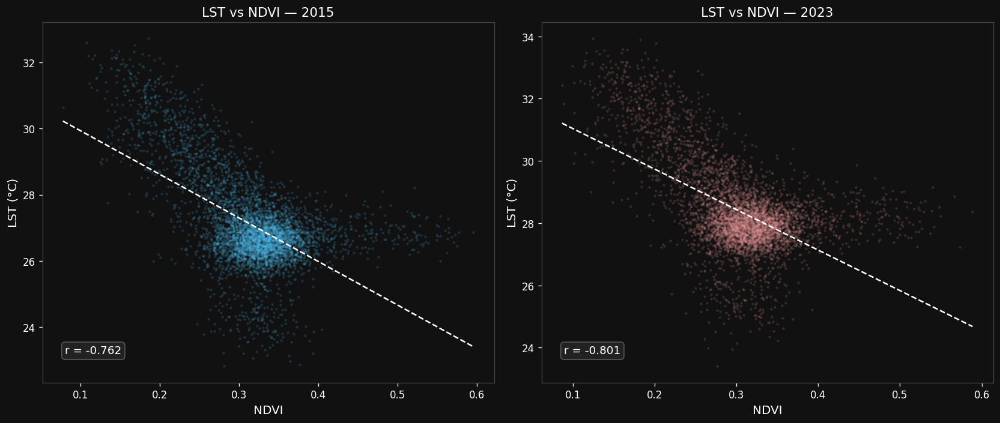
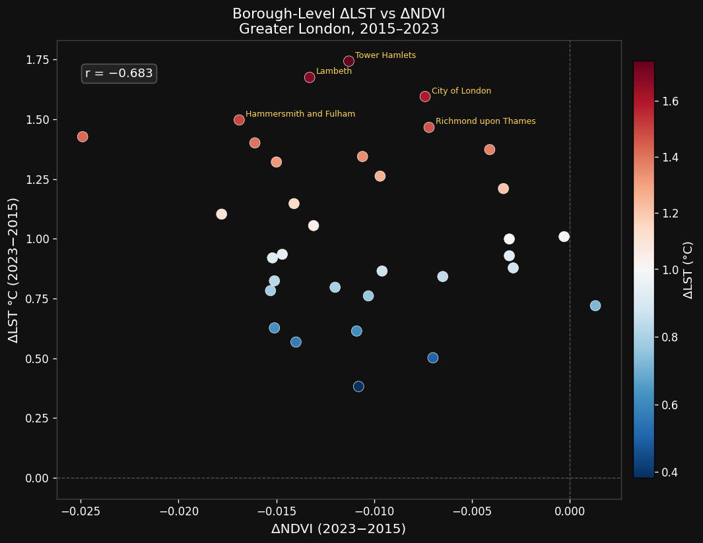

# 🌡️ Urban Heat Island Satellite Analysis — London, UK

[](https://www.python.org/)
[](https://opensource.org/licenses/MIT)
[](https://jupyter.org/)
[](https://earthexplorer.usgs.gov/)

---

## Abstract

This project investigates the urban heat island (UHI) effect in Greater London using multitemporal Landsat 8/9 satellite imagery acquired in 2015 and 2023. Land Surface Temperature (LST) is derived from thermal infrared Band 10 with emissivity correction, and compared against the Normalised Difference Vegetation Index (NDVI) to examine the relationship between green cover and surface heating. The analysis identifies spatial patterns in UHI intensification over the eight-year period, highlights the top five hotspot boroughs, and quantifies LST–NDVI correlations across the study area.

> **Key findings:** Mean LST across Greater London increased by **+1.14°C** between 2015 and 2023. The five most affected boroughs were **Tower Hamlets (+1.74°C), Lambeth (+1.68°C), City of London (+1.60°C), Hammersmith & Fulham (+1.50°C), and Richmond upon Thames (+1.47°C)**. Pixel-level LST–NDVI correlation strengthened from r = −0.762 (2015) to r = −0.801 (2023), confirming vegetation loss as a key driver of surface heating.

---

## Overview

Urban heat islands — where urban areas are significantly warmer than surrounding rural zones — pose growing risks to public health, energy demand, and urban liveability. London, with its dense built environment and relatively limited urban greening, provides an ideal case study for examining how UHI patterns have evolved over a near-decade period aligned with the city's urban growth and greening initiatives.

This repository contains all code, documentation, and processed outputs to reproduce the analysis from raw Landsat scenes through to publication-quality figures.

---

## Data Sources

| Dataset | Source | Description |
|---|---|---|
| Landsat 8 OLI/TIRS Collection 2 Level-2 | [USGS EarthExplorer](https://earthexplorer.usgs.gov/) | July–August 2015 scene, Path 201 / Row 024 |
| Landsat 9 OLI-2/TIRS-2 Collection 2 Level-2 | [USGS EarthExplorer](https://earthexplorer.usgs.gov/) | July–August 2023 scene, Path 201 / Row 024 |
| Greater London Authority Boundary | [London Datastore (GLA)](https://data.london.gov.uk/dataset/statistical-gis-boundary-files-london) | Statistical GIS boundary shapefile |
| London Boroughs Shapefile | [London Datastore (GLA)](https://data.london.gov.uk/dataset/statistical-gis-boundary-files-london) | Borough-level boundaries for spatial aggregation |

> **Note:** Raw Landsat `.TIF` files are excluded from this repository due to file size. See [How to Reproduce](#how-to-reproduce) for download instructions.

---

## Project Structure

```
urban-heat-island-london/
│
├── data/
│   ├── raw/                   # Raw Landsat scenes (git-ignored)
│   │   ├── landsat_2015/
│   │   └── landsat_2023/
│   └── processed/             # Clipped, reprojected rasters (tracked)
│       ├── lst_2015_london.tif
│       ├── lst_2023_london.tif
│       ├── ndvi_2015_london.tif
│       └── ndvi_2023_london.tif
│
├── docs/
│   └── methodology.md         # Full methodology write-up
│
├── notebooks/
│   ├── 01_data_prep.ipynb     # Data loading, clipping, preprocessing
│   ├── 02_analysis.ipynb      # LST/NDVI calculation, delta maps, hotspots
│   └── 03_visualisation.ipynb # Maps, plots, figure export
│
├── outputs/
│   ├── figures/               # Exported map PNGs
│   └── tables/                # Summary CSVs (hotspot boroughs, correlations)
│
├── shapefiles/
│   ├── greater_london_boundary.*
│   └── london_boroughs.*
│
├── .gitignore
├── LICENSE
├── README.md
└── requirements.txt
```

---

## Setup Instructions

### 1. Clone the repository

```bash
git clone https://github.com/ao-chaos/Data_portfolio.git
cd urban-heat-analysis
```

### 2. Create and activate a virtual environment

```bash
python -m venv venv

# macOS/Linux
source venv/bin/activate

# Windows
venv\Scripts\activate
```

### 3. Install dependencies

```bash
pip install -r requirements.txt
```

### 4. Download boundary shapefiles

Download the Greater London Authority boundary and borough shapefiles from the [London Datastore](https://data.london.gov.uk/dataset/statistical-gis-boundary-files-london) and place them in `/shapefiles/`.

---

## How to Reproduce

### Step 1 — Download Landsat scenes

1. Navigate to [USGS EarthExplorer](https://earthexplorer.usgs.gov/) and create a free account.
2. Set the study area to Greater London (centre: 51.5074° N, 0.1278° W; radius ~50 km).
3. Search for **Landsat Collection 2 Level-2** products:
   - **2015:** Landsat 8, Path 201 / Row 024, July–August, <10% cloud cover
   - **2023:** Landsat 9, Path 201 / Row 024, July–August, <10% cloud cover
4. Download and extract scenes to `data/raw/landsat_2015/` and `data/raw/landsat_2023/` respectively.

### Step 2 — Run notebooks in order

Launch JupyterLab:

```bash
jupyter lab
```

Then execute notebooks in sequence:

| Notebook | Purpose |
|---|---|
| `01_data_prep.ipynb` | Load bands, clip to London, save processed rasters |
| `02_analysis.ipynb` | Derive LST and NDVI, compute deltas, identify hotspots |
| `03_visualisation.ipynb` | Generate all figures and export to `/outputs/figures/` |

---

## Results

### Land Surface Temperature — 2015 vs 2023


### LST Change Map (ΔLST 2023 − 2015)


### Top 10 Hotspot Boroughs


### LST vs NDVI Correlation


### Borough-Level ΔLST vs ΔNDVI


---

## Methodology Summary

See [`docs/methodology.md`](docs/methodology.md) for the full write-up, including:

- Study area definition and coordinate reference system (EPSG:27700 BNG)
- Landsat scene selection rationale (summer acquisitions, cloud masking)
- LST derivation from Band 10 brightness temperature with emissivity correction
- NDVI calculation and normalisation
- Limitations and sources of uncertainty

---

## License

This project is licensed under the [MIT License](LICENSE).

---

## Citations & References

- USGS. (2023). *Landsat Collection 2 Level-2 Science Product Guide*. U.S. Geological Survey. https://www.usgs.gov/landsat-missions
- Jiménez-Muñoz, J. C., & Sobrino, J. A. (2003). A generalized single-channel method for retrieving land surface temperature from remote sensing data. *Journal of Geophysical Research: Atmospheres*, 108(D22). https://doi.org/10.1029/2003JD003480
- Sobrino, J. A., Jiménez-Muñoz, J. C., & Paolini, L. (2004). Land surface temperature retrieval from LANDSAT TM 5. *Remote Sensing of Environment*, 90(4), 434–440. https://doi.org/10.1016/j.rse.2004.02.003
- Greater London Authority. (2023). *Statistical GIS Boundary Files for London*. London Datastore. https://data.london.gov.uk
- Rouse, J. W., et al. (1974). Monitoring vegetation systems in the Great Plains with ERTS. *Third ERTS Symposium, NASA*, 1, 309–317.
- EarthPy Contributors. (2021). *EarthPy: A Python package that makes it easier to explore and plot imagery from a variety of sources*. https://earthpy.readthedocs.io

---

*Analysis conducted by Zari Syed · 2025*
